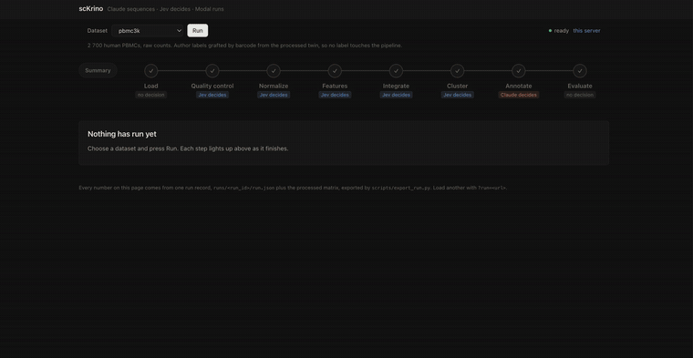

# Krino

<p align="center">
  <a href="docs/media/krino-demo.mp4">
    
  </a>
  <br>
  <sub><b><a href="docs/media/krino-demo.mp4">▶ Watch the full demo (MP4, 67 s)</a></b> · the preview above plays at 3× speed.
  Shown: the pbmc3k demo, a recorded run replayed with Jev's probabilities flattened for display, as the page's banner says; every other dataset runs live.</sub>
</p>

An scRNA-seq analysis pipeline where the judgement calls are explicit.
*Krino* is from the Greek κρίνω, "to separate, to judge": the pipeline's job
is to separate cells, and its design is about who gets to judge each call.

**Claude** decides *which step runs next*, **frames each decision point for the
data in front of it**, and reads the marker genes.
**Jev** (TypeSafe's System One model) *answers* those typed questions — filtering
stringency, normalization method, HVG count, whether integration is needed,
clustering resolution — with a calibrated probability.
**Modal** runs the whole thing.

Every stage runs the same three beats:

1. **Claude builds the typed context** — the baseline question plus the observed
   statistics, rewritten for this matrix, with the candidate answers narrowed to
   what applies here.
2. **Jev decides** among those candidates, with a calibrated probability. Below
   the confidence floor the step's declared default is used and the fallback is
   recorded.
3. **The chosen thing runs** — a threshold, a method, or an entire *model*.
   `executors.py` dispatches it in-process or, with `MODAL_REMOTE=1`, to a Modal
   function, so a stage that selects a GPU-bound model sends only that model
   remotely.

The framing step matters. A step ships a generic baseline question, written
before anyone saw the matrix; Claude rewrites it against the observed statistics,
drops options that do not apply to this data, and describes each survivor in
terms of what it would do *here*. Claude may only narrow and reword — option keys
are branch labels the step dispatches on, so an invented key is a decision the
code cannot execute, and anything unrecognised is dropped. See
`src/scrnapipeline/planner.py`.

Every decision is recorded with its source and confidence, so a run is auditable
after the fact: which knob was set by the decision model, which fell back to a
default, and what the resulting clustering scored against ground truth.

## Why split it this way

A standard scRNA-seq workflow is mostly mechanical. What is *not* mechanical is a
handful of contested choices — the mitochondrial cutoff, log1p-CPM vs. Pearson
residuals, Leiden resolution — that get made once by whoever wrote the notebook
and then never revisited. Those are exactly the points a calibrated decision
model is for: typed output, a probability attached, and a confidence floor below
which the pipeline falls back to the declared default and says so.

Prose generation is a bad fit for that job and a good fit for two others:
sequencing the run and reading a ranked marker list. Claude does those.

## Pipeline

| # | Step | Decision point | Decided by |
|---|------|----------------|-----------|
| 1 | `load` | — (start from a public processed matrix) | — |
| 2 | `qc` | filtering stringency; whether to score doublets | Jev |
| 3 | `normalize` | log1p-CPM vs. Pearson residuals vs. pooled size factors | Jev |
| 4 | `features` | how many HVGs; how many PCs | Jev |
| 5 | `integrate` | whether integration is needed at all; which method | Jev |
| 6 | `cluster` | Leiden resolution | Jev |
| 7 | `annotate` | cell-type label from top markers | Claude |
| 8 | `evaluate` | — (annotation accuracy, ARI/NMI, linear probe) | — |

Every question in the Jev column is first framed by Claude for the dataset at
hand; the table lists what is being decided, not who wrote the wording.

Alignment and UMI dedup (Cell Ranger / STARsolo / alevin-fry) are out of scope;
the pipeline starts from a count matrix.

## Datasets

| Spec | Counts | Ground truth | Batches | Use |
|------|--------|--------------|---------|-----|
| `pbmc3k` | raw | 8 types, grafted by barcode from `pbmc3k_processed` | 1 | the 2-minute smoke run |
| `pbmc68k_reduced` | processed | `bulk_labels` | 1 | quick label sanity |
| `h5ad:<path>` | yours | `--label-key` | yours | anything else |
| `sctab_val_raw` | **raw** | CELLxGENE ontology `cell_type` | yes | every decision is live — the one to demo on |
| `sctab_train_preprocessed` | pre-normalized | CELLxGENE ontology `cell_type` | yes | evaluation; `qc` and `normalize` skip |
| `merlin:<dir>` | **pre-normalized** | 164 CELLxGENE ontology types | ~740 `tech_sample` | evaluation + scTab head-to-head |

`python -m scrnapipeline.cli datasets` lists these. **No loader trusts a
filename**: `_prepare_h5ad` measures whether `X` holds non-negative integers and
sets `pre_normalized` from that, detects the label column, finds a batch key, and
flags scTab's 19,331-gene feature space. A file called `raw` that isn't raw would
otherwise be normalized twice, silently — which is the same failure the Merlin
store produced, and the reason the check exists.

**The scTab Merlin store is not a raw input.** Measured on
`merlin_cxg_2023_05_15_sf-log1p_minimal`: `X` is float with max 4.897 and 75%
zeros — already size-factor + log1p normalized, already QC-filtered, already cut
to scTab's fixed 19,331-gene feature space. Loading it sets `pre_normalized`, and
`qc` and `normalize` then **skip with a stated reason** rather than log1p the data
a second time.

That costs the two most contested decision points in the pipeline, which is why
it is the wrong substrate to demo the Jev layer on. What it is very good at is
the other half: 164 ontology-controlled cell types and ~740 technical samples in
a single 32,768-cell split, in the exact feature space scTab expects. Use it to
score annotation and to run the head-to-head; use a raw-count dataset to exercise
the decisions.

## Evaluation

The terminal output is a cell type per cell, so the headline number is how often
that call is right. Three readouts, deliberately different in kind, all against
held-out author labels:

- **annotation accuracy** — the pipeline's actual cell-type calls vs. the
  author's. This is the real bar. It is strictly harder than ARI: a partition can
  be perfect while every label on it is wrong. Reported as exact match and as a
  normalised match, because Claude writes "CD14+ Monocyte" where CELLxGENE says
  "CD14-positive monocyte" and that difference is vocabulary, not error.
- **unsupervised** — ARI and NMI of the Leiden partition vs. the ground-truth
  cell types. Asks whether the pipeline's decisions recovered known structure,
  independent of naming.
- **supervised** — a logistic-regression probe on the PCA embedding, 70/30
  stratified. Asks how much cell-type information the representation carries at
  all, independent of where the cluster boundaries landed.

`pbmc3k` is loaded raw and its labels are grafted by barcode from
`pbmc3k_processed`, so no label touches the pipeline itself.

### Is scTab the right annotator?

That is not a question the pipeline answers once, in its source. `annotate` makes
the **model itself a decision**: `markers_llm` (Claude reads the markers),
`celltypist` (logistic regression over curated references), or `sctab`. Claude
frames the trade-off against the data, Jev picks, and the run records why.

`sctab` is only offered when `sctab_feature_space` is set — i.e. when the matrix
is already in its fixed 19,331-gene space. Running scTab on a matrix in a
different gene space is not a worse answer, it is a broken one, so it is removed
from the ballot rather than left as a trap.

[scTab](https://github.com/theislab/scTab) (Fischer et al., *Nat Commun* 2024) is
the intended reference column — a de novo classifier trained across CELLxGENE, which
answers the annotation question without any of this pipeline's choices.
**It is not wired up yet**: `src/scrnapipeline/baselines.py` holds the slot and
raises `NotImplementedError` rather than reporting a placeholder number. The
adapter needs the 8.1 GB checkpoint and a `var_names` → Merlin feature-space
mapping.

## Running it

```bash
pip install -e .

# fully offline: no API calls, every decision takes its declared default
JEV_OFFLINE=1 CLAUDE_OFFLINE=1 python -m scrnapipeline.cli run --dataset pbmc3k

# Jev decides, fixed step order
python -m scrnapipeline.cli run --dataset pbmc3k

# Claude sequences the run, Jev decides inside each step
python -m scrnapipeline.cli run --dataset pbmc3k --mode agent
```

On Modal:

```bash
# Put the keys in a mode-600 file OUTSIDE any repo, then hand that file to Modal.
# --from-dotenv keeps them off the command line, where `ps` would expose them to
# anyone else on a shared machine.
modal secret create ai-gateway --from-dotenv ~/.config/modal-hackathon/ai-gateway.env
modal run modal_app.py --dataset pbmc3k --mode agent
```

Clustering needs `igraph` + `leidenalg`; they are in the Modal image and in
`pyproject.toml`, but a bare local env may not have them.

Output lands in `runs/<run_id>/`: `run.json` (decisions, step records, metrics)
and `processed.h5ad`.

## The demo UI

`web/` is a static one-page walkthrough of a finished run: the eight steps, and
at each one the options Jev was choosing between, the probability on each, the
confidence against the floor, and plots of the data at that point. No build
step, no framework — it is served as files.

```bash
python scripts/export_run.py runs/<run_id> web/data/run-demo.json --demo
cd web && python3 -m http.server 5173     # or: npx vercel deploy --prod
```

`export_run.py` joins `run.json` with `processed.h5ad` (embedding, per-cell QC,
clusters, markers) into the single record the page reads, and re-derives each
decision's option set from the same step objects the pipeline used, so the page
cannot show options the pipeline never offered. Details in `web/README.md`.

## Credentials

**No key is ever written into this repo, into the Modal image, or into a run
record.** The layout:

- keys live in `~/.config/modal-hackathon/`, mode 600, outside the working
  tree; `scripts/serve_local.sh` exports them into the server process only.
  No `.env` (not even a symlink) is kept in the repo directory
- on Modal they live in the `ai-gateway` Modal secret and reach the container as
  an environment variable
- Jev is reached through the **Vercel AI Gateway**: the Vercel `vck_...` key *is*
  the TypeSafe key, and the base URL is `https://ai-gateway.vercel.sh/typesafe`
  (the SDK appends `/v1/systemone`). So `AI_GATEWAY_API_KEY` is a correct
  fallback for `TYPESAFE_API_KEY`.
- It is **not** a correct fallback for Claude. A gateway key sent to
  `api.anthropic.com` comes back as a bare 401 that looks like a broken key, so
  `AI_GATEWAY_API_KEY` is only used for Claude when `ANTHROPIC_BASE_URL` is also
  set — i.e. when a gateway is deliberately in the path.
- `scripts/scan_secrets.py` is key-anchored, not value-anchored — it trips on any
  `*_API_KEY`/`_TOKEN`/`_SECRET` assigned a literal, not just on key prefixes
  someone thought to list
- a `pre-push` hook runs that scanner over the outbound commits

**`.git/hooks` does not survive a clone.** After cloning:

```bash
./scripts/install_hooks.sh
```

## Layout

```
modal_app.py                 Modal image, volume, secret, entrypoint
src/scrnapipeline/
  config.py                  env-driven settings, gateway key fallback
  state.py                   RunState: observations, decisions, step records
  jev.py                     decision layer: ChoiceQ/NoulQ/ScoreQ, confidence floor
  claude.py                  annotator + manual tool-use orchestration loop
  registry.py                canonical step order, dependencies, tool schemas
  pipeline.py                scripted and agent drivers
  baselines.py               scTab slot (not implemented)
  steps/                     one module per pipeline step
scripts/scan_secrets.py      push guard
scripts/export_run.py        run.json + processed.h5ad -> the web demo's record
web/                         static demo UI; see web/README.md
tests/                       infra tests; no network, no keys
```

## Status

Hackathon scaffold. Steps 1–8 run; the agent loop and the Jev layer are wired but
have only been exercised offline.
